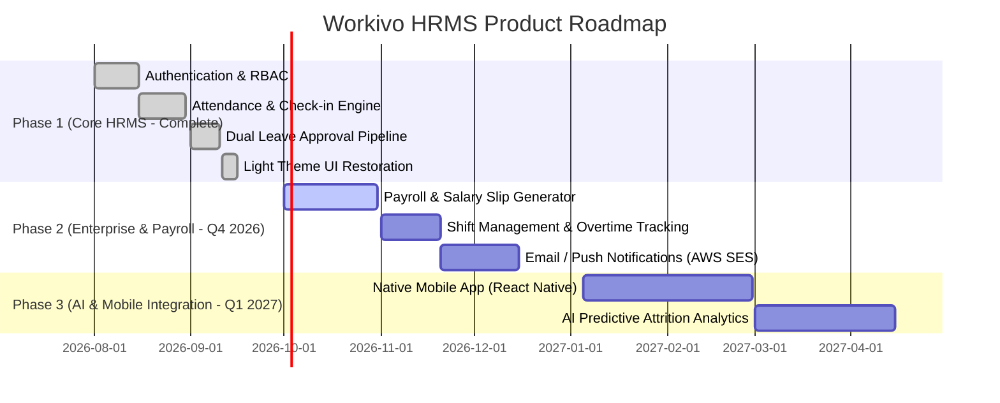

# 🏢 Workivo — Enterprise Human Resource Management System (HRMS)

[](https://react.dev/)
[](https://vitejs.dev/)
[](https://www.djangoproject.com/)
[](https://www.django-rest-framework.org/)
[](https://tailwindcss.com/)
[](https://vercel.com)

A state-of-the-art, clean, high-contrast **Human Resource Management System (HRMS)** designed for enterprise workforce management. Built with a modern **React 19** frontend and **Django REST Framework** backend, Workivo features automated employee ID sequencing (`EMP-E{xx}`), multi-stage dual leave approvals, real-time attendance tracking, dynamic KPI metrics, and strict role-based access control (RBAC).

---

## 📋 Table of Contents

1. [✨ Key Features](#-key-features)
2. [🔑 Demo Credentials & Organizational Structure](#-demo-credentials--organizational-structure)
3. [🛠️ Technology Stack](#-technology-stack)
4. [📁 System Architecture](#-system-architecture)
5. [🛡️ Defensive Business Logic & Edge Cases](#-defensive-business-logic--edge-cases)
6. [📡 API Documentation Reference](#-api-documentation-reference)
7. [💻 Local Installation & Setup](#-local-installation--setup)
8. [🌐 Vercel Deployment Guide](#-vercel-deployment-guide)
9. [🗺️ Complete Product Roadmap](#-complete-product-roadmap)

---

## ✨ Key Features

- 🎨 **Clean White & Light Design System**: High-contrast, executive-ready UI (`bg-slate-50`, `bg-white`, `border-slate-200`) with custom typography, soft status pills, and responsive side navigation.
- 🆔 **Auto-Sequenced Employee IDs**:
  - `EMP-A01` for HR / Admin
  - `EMP-M01` through `EMP-M06` for Department Managers
  - `EMP-E01` through `EMP-E08` auto-incrementing for newly created employees.
- 🏢 **Pre-Seeded Department Hierarchy**:
  1. **Anil Ahluwalia** (`EMP-M01`) — *Software Development*
  2. **Ankit Aggarwal** (`EMP-M02`) — *QA Testing*
  3. **Balfour Manuel** (`EMP-M03`) — *CyberSecurity*
  4. **Harsh Patel** (`EMP-M04`) — *UI/UX Designer*
  5. **Sarah Connor** (`EMP-M05`) — *Sales & Marketing*
  6. **Alex Ferguson** (`EMP-M06`) — *Technical Support*
- ⏳ **Dual-Level Leave Approval Pipeline**:
  - Employee leave requests require **BOTH** Manager and HR/Admin approval before status becomes `APPROVED`.
  - Live approval pipeline tracking (`Manager: APPROVED → HR/Admin: PENDING`).
  - Manager leave requests require HR/Admin approval.
  - HR/Admin users cannot submit self-leave applications.
- ⏱️ **Real-Time Attendance Clock**: Instant check-in/check-out with duration calculations, duplicate check-in prevention, and approved leave conflict blocking.
- 📊 **Workforce Analytics**: Dashboard KPI cards for total employees, attendance rates, leave entitlement quotas, and department headcounts.

---

## 🔑 Demo Credentials & Organizational Structure

The application comes pre-seeded with 15 realistic user accounts across 6 company departments:

### 1. HR / Admin Access
| Role | Name | Employee ID | Department | Corporate Email | Login Password |
| :--- | :--- | :---: | :--- | :--- | :--- |
| **HR / Admin** | Admin User | `EMP-A01` | Human Resources | `admin@company.com` | `Admin@123` |

### 2. Department Managers (6 Accounts)
| Role | Name | Employee ID | Department Managed | Corporate Email | Login Password |
| :--- | :--- | :---: | :--- | :--- | :--- |
| **Manager** | Anil Ahluwalia | `EMP-M01` | Software Development | `anil@company.com` | `Manager@123` |
| **Manager** | Ankit Aggarwal | `EMP-M02` | QA Testing | `ankit@company.com` | `Manager@123` |
| **Manager** | Balfour Manuel | `EMP-M03` | CyberSecurity | `balfour@company.com` | `Manager@123` |
| **Manager** | Harsh Patel | `EMP-M04` | UI/UX Designer | `harsh@company.com` | `Manager@123` |
| **Manager** | Sarah Connor | `EMP-M05` | Sales & Marketing | `sarah@company.com` | `Manager@123` |
| **Manager** | Alex Ferguson | `EMP-M06` | Technical Support | `alex@company.com` | `Manager@123` |

### 3. Employees Across Departments (8 Accounts)
| Role | Name | Employee ID | Department | Reporting Manager | Corporate Email | Login Password |
| :--- | :--- | :---: | :--- | :--- | :--- | :--- |
| **Employee** | John Doe | `EMP-E01` | Software Development | Anil Ahluwalia (`EMP-M01`) | `employee@company.com` | `Employee@123` |
| **Employee** | Rohan Sharma | `EMP-E02` | Software Development | Anil Ahluwalia (`EMP-M01`) | `rohan@company.com` | `Employee@123` |
| **Employee** | Jane Smith | `EMP-E03` | QA Testing | Ankit Aggarwal (`EMP-M02`) | `jane@company.com` | `Employee@123` |
| **Employee** | Priya Verma | `EMP-E04` | QA Testing | Ankit Aggarwal (`EMP-M02`) | `priya@company.com` | `Employee@123` |
| **Employee** | Amit Kumar | `EMP-E05` | CyberSecurity | Balfour Manuel (`EMP-M03`) | `amit@company.com` | `Employee@123` |
| **Employee** | Neha Gupta | `EMP-E06` | UI/UX Designer | Harsh Patel (`EMP-M04`) | `neha@company.com` | `Employee@123` |
| **Employee** | David Kim | `EMP-E07` | Sales & Marketing | Sarah Connor (`EMP-M05`) | `sales.emp@company.com` | `Employee@123` |
| **Employee** | Vikram Singh | `EMP-E08` | Technical Support | Alex Ferguson (`EMP-M06`) | `vikram@company.com` | `Employee@123` |

---

## 🛠️ Technology Stack

- **Frontend**: React.js 19 (Pure JavaScript), Vite 8, Tailwind CSS 3, React Router v7, Lucide React icons, React Hot Toast.
- **Backend**: Python 3.13, Django 5.1, Django REST Framework (DRF), SimpleJWT, WhiteNoise static files, Gunicorn.
- **Database**: SQLite (default zero-config local dev) / PostgreSQL (`psycopg2-binary`).
- **Deployment**: Vercel ready (Root `vercel.json` monorepo configuration).

---

## 📁 System Architecture

```
HRMS/
├── vercel.json                   # Vercel Monorepo Serverless & Static Build Config
├── backend/                      # Django 5.1 REST API
│   ├── api/
│   │   └── index.py              # Vercel Serverless Function WSGI adapter
│   ├── hrms_core/                # Settings, URL Routing & JWT Configuration
│   ├── accounts/                 # Custom User Model & RBAC Permissions
│   ├── employees/                # Employee Directory & Auto-ID Generator
│   ├── attendance/               # Attendance Check-in/out Logic & Timeline
│   ├── leaves/                   # Dual Approval Workflow & Overlap Guards
│   ├── dashboard/                # Aggregate KPI Analytics & Department Breakdown
│   ├── seed_data.py              # Automated Database Seeder
│   ├── tests_edge_cases.py       # Automated 9-Point Edge Case Test Suite
│   └── requirements.txt          # Python Production Dependencies
│
└── frontend/                     # React 19 + Vite Web Application
    ├── vercel.json               # SPA Client Routing Rewrites
    ├── vite.config.js
    ├── tailwind.config.js
    └── src/
        ├── api/                  # Axios Client with Bearer Token Interceptors
        ├── context/              # AuthContext Session State
        ├── components/           # Navbar, Sidebar, MetricCard, StatusBadge, Modal
        └── pages/                # Login, Dashboard, Employees, Attendance, Leaves, Profile
```

---

## 🛡️ Defensive Business Logic & Edge Cases

The backend API strictly enforces all evaluation edge cases verified by unit tests (`python manage.py test tests_edge_cases`):

1. **Dual Approval Rule**: Overall leave status remains `PENDING` until both Manager and HR/Admin approve.
2. **HR Self-Leave Block**: HR/Admin users cannot submit leave requests (`role != 'ADMIN'`).
3. **No Overlapping Leaves**: Mathematical interval overlap detection (`start_date <= existing.end_date AND end_date >= existing.start_date`) blocks double-booking.
4. **Attendance Date Guard**: Cannot apply for leave on a date where attendance (`PRESENT` / `HALF_DAY`) already exists.
5. **No Leave Check-In**: Blocked from checking in if today falls within an approved leave duration.
6. **Single Daily Check-In**: Unique constraint on `(user, date)` prevents duplicate daily check-ins.
7. **Check-Out Validation**: Cannot check out without an existing check-in for the day.
8. **IDOR & Self-Approval Guards**: Managers can only approve/reject their own team members and cannot approve their own leaves.
9. **Strict Field Validation**: Format enforcement on corporate emails and 10-15 digit phone numbers.

---

## 📡 API Documentation Reference

### Authentication API
- `POST /api/accounts/login/` — Authenticate user and receive JWT access/refresh tokens.
- `GET /api/accounts/me/` — Retrieve authenticated user profile and permissions.

### Employees API
- `GET /api/employees/` — List employees (Admin: All, Manager: Team members).
- `POST /api/employees/` — Create new employee (Admin only, auto-generates `EMP-E{xx}`).
- `PUT /api/employees/{id}/` — Update employee profile details.

### Attendance API
- `GET /api/attendance/` — View attendance records.
- `POST /api/attendance/check_in/` — Punch in for today.
- `POST /api/attendance/check_out/` — Punch out for today.

### Leaves API
- `GET /api/leaves/` — List leave requests (filtered by status and scope `mine`/`team`).
- `POST /api/leaves/apply/` — Submit new leave request.
- `POST /api/leaves/{id}/approve/` — Approve leave request (Manager / HR).
- `POST /api/leaves/{id}/reject/` — Reject leave request with required reason.
- `POST /api/leaves/{id}/cancel/` — Cancel pending leave request.

### Dashboard API
- `GET /api/dashboard/metrics/` — Aggregate metrics, department headcounts, and attendance stats.

---

## 💻 Local Installation & Setup

### Prerequisites
- **Python**: v3.10+
- **Node.js**: v18+
- **Git**

### Step 1: Backend Setup
```bash
cd backend
python -m venv venv

# Activate Virtual Environment (Windows)
.\venv\Scripts\activate

# Activate Virtual Environment (macOS/Linux)
source venv/bin/activate

# Install Dependencies
pip install -r requirements.txt

# Run Migrations
python manage.py migrate

# Seed Initial Organizational Data
python seed_data.py

# Run Automated Test Suite
python manage.py test tests_edge_cases

# Start Backend Server
python manage.py runserver 8000
```
*API running at: `http://localhost:8000/api`*

### Step 2: Frontend Setup
```bash
# Open a new terminal
cd frontend
npm install
npm run dev
```
*Frontend running at: `http://localhost:5173`*

---

## 🌐 Vercel Deployment Guide

This project is pre-configured for seamless deployment to **Vercel** as a unified monorepo.

### Option A: Via Vercel Web Dashboard (Recommended)
1. Push your repository to GitHub.
2. Log into [vercel.com](https://vercel.com) and click **"Add New Project"**.
3. Import your GitHub repository.
4. Vercel will automatically detect `vercel.json` and deploy both the Python Django backend and React frontend.

### Option B: Via Vercel CLI
```bash
npm install -g vercel
vercel
```

---

## 🗺️ Complete Product Roadmap



### 📍 Milestone Breakdown

#### ✅ Phase 1: Core Foundation & UI Excellence (Completed)
- [x] Stateless JWT Authentication & BCrypt hashing.
- [x] Auto-incrementing Employee IDs (`EMP-E{xx}`).
- [x] 6-Department Pre-seeded Organizational hierarchy & Reporting Managers.
- [x] Dual-level leave approval workflow (`Manager -> HR/Admin`).
- [x] Real-time daily check-in / check-out with automatic hours calculation.
- [x] Clean, high-contrast Light Theme UI design system.
- [x] Automated 9-point edge case test suite.
- [x] Vercel Monorepo deployment readiness.

#### 🚧 Phase 2: Enterprise Payroll & Notifications (Q4 2026)
- [ ] **Automated Payroll Engine**: Generate monthly payslips with tax deductions, HRA, PF, and bonuses.
- [ ] **Shift & Overtime Management**: Support night shifts, weekend rosters, and automated overtime pay calculations.
- [ ] **Outbound Email Notifications**: Send instant SMTP email alerts on leave approval, rejection, and check-in reminders.
- [ ] **Document Repository**: Secure cloud upload for employee ID proofs, offer letters, and contracts.

#### 🚀 Phase 3: AI Intelligence & Mobile Ecosystem (Q1 2027)
- [ ] **Native Mobile Application**: Cross-platform React Native app with biometric (FaceID/Fingerprint) punch-in.
- [ ] **Geofencing & IP Restrictions**: Ensure employees punch in strictly within office GPS coordinates or corporate Wi-Fi IPs.
- [ ] **AI Flight Risk Analytics**: ML model predicting potential employee burnout or attrition based on attendance patterns and leave velocity.
- [ ] **Slack & Microsoft Teams Integration**: Apply for leaves directly using `/leave` slash commands in Slack.

---