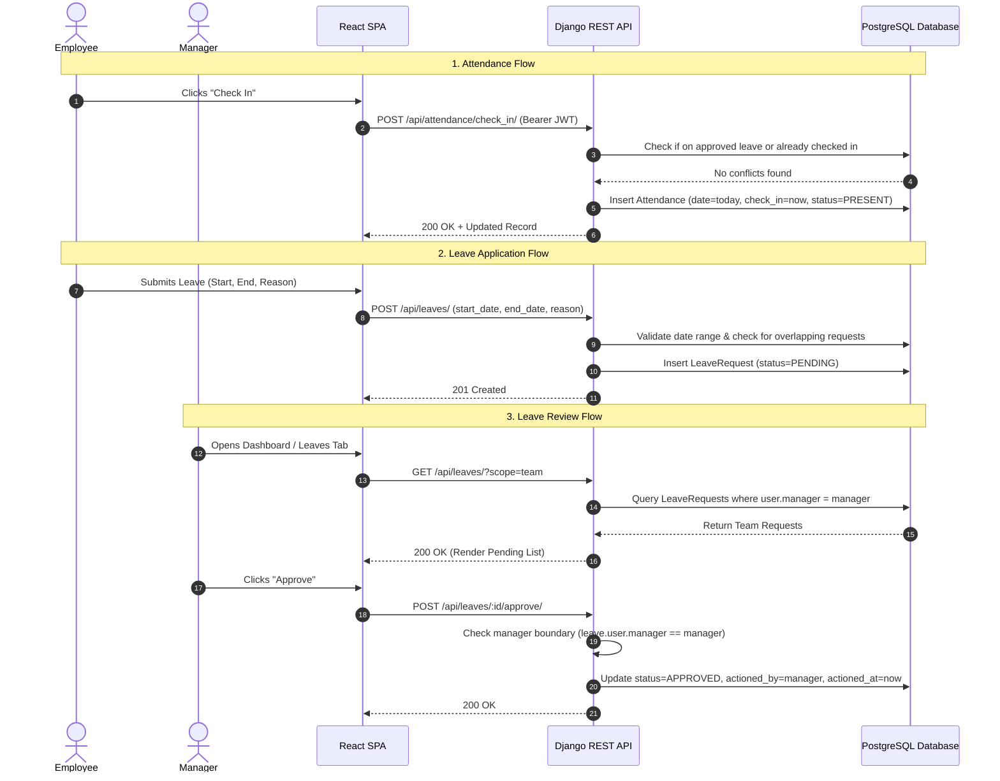
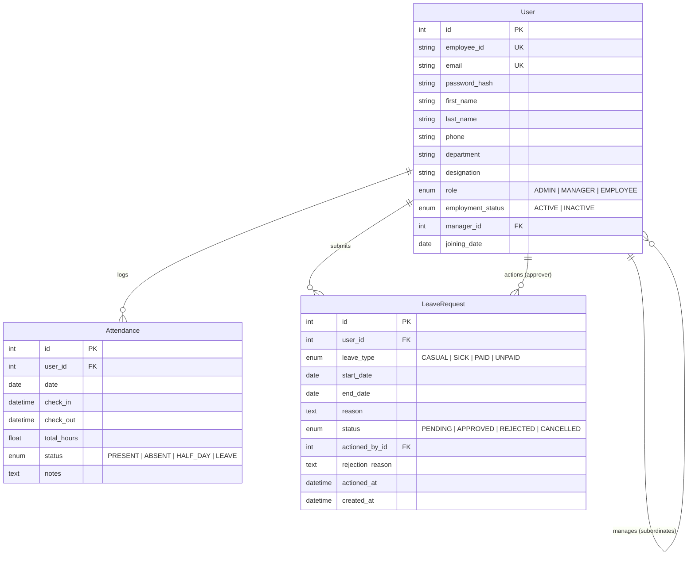

# HRMS Technical Planning & Architecture Document

Prepared for the **AppTrait Solutions Practical Assessment: Vibe Coder**.

---

## 1. Requirement Breakdown & Module Identification

The Mini HRMS is divided into 5 tightly integrated modules:

### A. Authentication & Authorization Module (`accounts`)
- **JWT-Based Authentication**: Secure stateless authentication using `djangorestframework-simplejwt`.
- **Role-Based Access Control (RBAC)**: Enforcing strict permissions across three user personas: `HR / Admin`, `Manager`, and `Employee`.
- **BCrypt Password Hashing**: Hashing corporate passwords with BCrypt before storage in PostgreSQL.
- **Session & Status Validation**: Blocks deactivated/terminated employees at both authentication and API middleware layers.

### B. Employee Management Module (`employees`)
- **HR/Admin Operations**: Add new employees, update details, search, filter, and toggle employment status (`ACTIVE` vs `INACTIVE`).
- **Team Hierarchy**: Self-referencing foreign key linking each employee to their designated reporting manager.
- **Self-Service Profile**: Employees can view their official profile and update personal contact details (phone, name) while sensitive attributes (salary, role, manager, status) remain locked.

### C. Attendance Management Module (`attendance`)
- **Daily Clock-In / Clock-Out**: Employees record their attendance timestamp.
- **Duration & Status Computation**: Automatically computes total worked hours upon check-out and derives status:
  - `>= 8.0 hours`: `PRESENT`
  - `4.0 to < 8.0 hours`: `HALF_DAY`
  - `< 4.0 hours`: `HALF_DAY`
- **Scoped Visibility**:
  - HR/Admin: Full company roster with date and employee filters.
  - Manager: Direct subordinates in their team.
  - Employee: Personal timeline only.

### D. Leave Management Module (`leaves`)
- **Multi-Type Leave Applications**: Casual, Sick, Paid, and Unpaid leave types.
- **Defensive Boundary Validation**: Prevents invalid date ranges, overlapping approved/pending leaves, and conflicts with attended days.
- **Hierarchical Approval Workflow**:
  - Subordinates' requests appear in their manager's approval queue.
  - Managers can approve or reject (rejection requires mandatory reason).
  - Managers are prohibited from approving their own leave requests (escalates to HR).
  - Cross-team approval attempts (IDOR) are strictly blocked with HTTP 403.

### E. Analytics Dashboard Module (`dashboard`)
- **Real-Time Aggregates**: No hardcoded dummy data; all counts are computed dynamically via optimized Django ORM queries.
- **Role-Specific Views**:
  - Admin: Total headcount, active headcount, present today, on leave today, pending company leaves.
  - Manager: Total team size, team present today, team on leave today, pending team approvals.
  - Employee: Today's check-in status card, lifetime leave breakdown, and recent attendance log.

---

## 2. Application Flow

---

## 3. Database Design

### Entity Relationship Model

### Table Indexes & Constraints
1. `User.email`: Unique index, primary authentication identifier.
2. `User.employee_id`: Unique index, organizational identifier (`EMP-001`).
3. `Attendance(user_id, date)`: Composite unique constraint preventing duplicate daily check-in records.
4. `LeaveRequest(user_id, status, start_date, end_date)`: Indexed for rapid overlap verification.

---

## 4. Technology Selection & Rationale

| Layer | Selected Tech | Rationale & Justification |
| :--- | :--- | :--- |
| **Frontend** | **React.js (JavaScript) + Vite** | Blazing-fast HMR and build performance. Pure JavaScript ensures maximum clarity and zero transpilation complexity. Component-driven architecture using reusable Tailwind UI elements. |
| **Styling** | **Tailwind CSS + Lucide Icons** | Utility-first CSS providing a cohesive, modern SaaS look (similar to Keka HR) with responsive mobile layouts and consistent color-coded status badges. |
| **Backend** | **Python + Django 5 + DRF** | Industry standard for enterprise business systems. Built-in ORM with declarative models, migrations, and serializers. Django REST Framework offers battle-tested permission classes, JWT integrations, and validation hooks. |
| **Database** | **PostgreSQL (with SQLite dev fallback)** | Full relational integrity with ACID guarantees, foreign keys, and unique composite constraints. Supported natively via `psycopg2-binary`. |
| **Auth & Security** | **JWT (`simplejwt`) + BCrypt** | Stateless tokens with claims (`role`, `email`). Passwords are never stored in plain text; BCrypt provides resistant, salted cryptographic hashes. |
| **Hosting** | **Vercel / Render / Neon** | Frontend deploys on Vercel; Django backend and PostgreSQL deploy on Render/Railway/Fly.io or Neon serverless PostgreSQL. |
